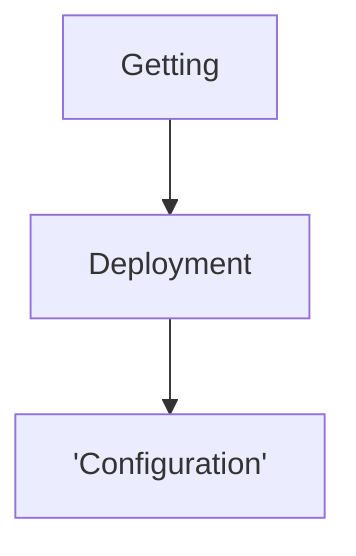
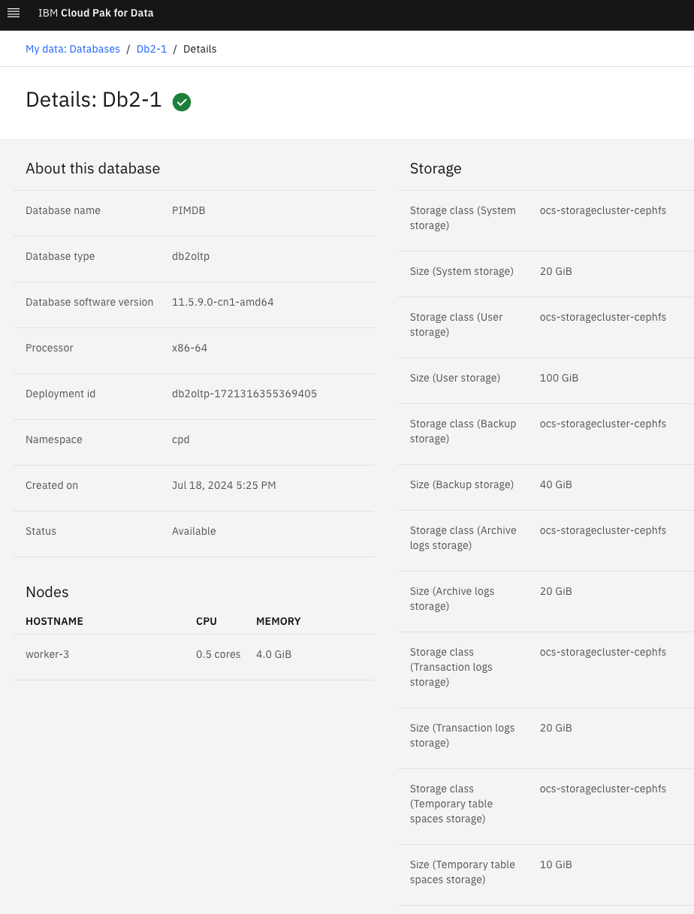
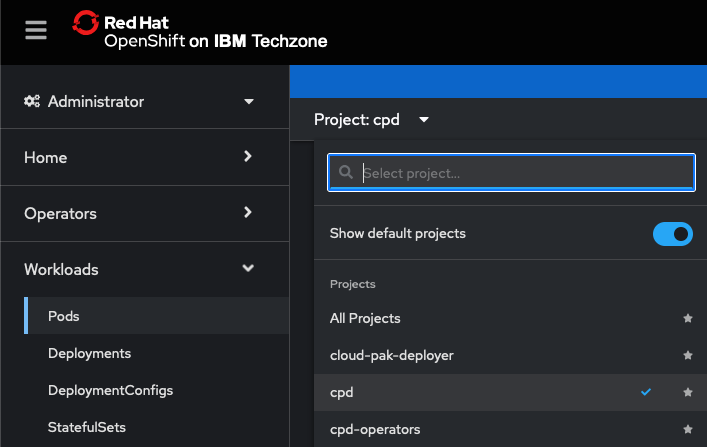
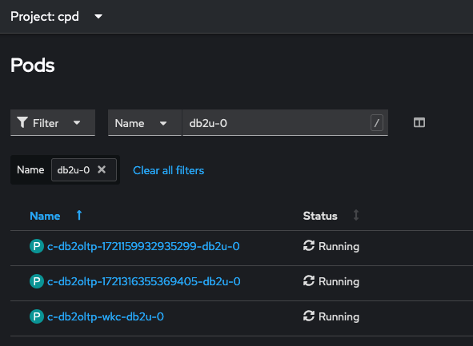
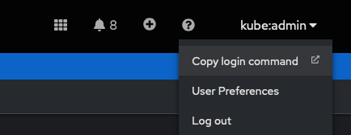
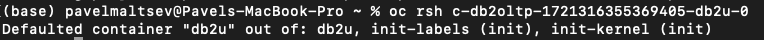
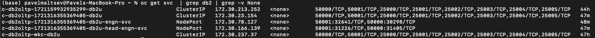
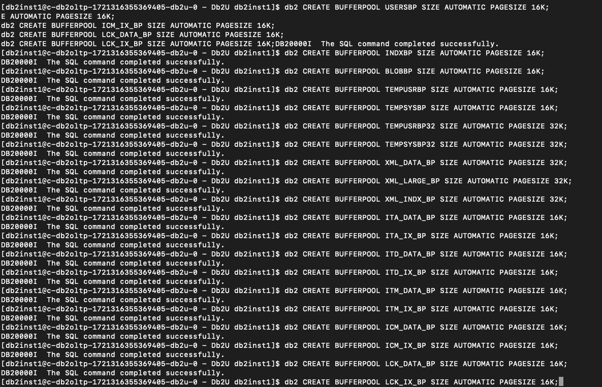
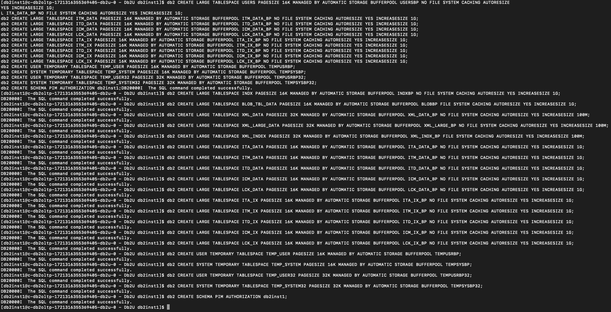
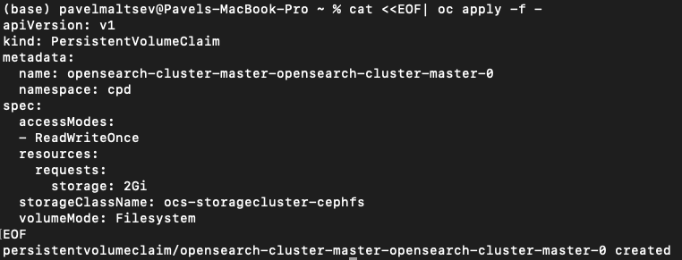

The deployment of Product Master on CP4D v5 is performed as a sequencial install of several components in a proper order. In many of the steps prior to continue with deployment of next component the specific configuration activiites on the previous one have to be performed.

```mermaid
graph TD;
    Getting configuration of the cluster-->Deployment of the cpd-cli on the bastion node;
    Deployment of the cpd-cli on the bastion node-->Confugration of environment variables;
    Deployment of DB2 service on CP4D-->Creation and configuration of PIMDB on DB2;
    Deployment of IKC service on CP4D-->Creation and configuration of Catalog and user token on IKC;
    Creation and configuration of Catalog and user token on IKC-->Start of Product Master Service deployment;
    Creation and configuration of PIMDB on DB2-->Start of Product Master Service deployment;
    Deployment of OpenSearch service on Openshift-->Start of Product Master Service deployment;
    Start of Product Master Service deployment-->Product Master Service deployment;
    Product Master Instance deployement start-->Product Master Instance deployment;
    Product Master Instance deployment-->Post-install configuration of Product Master;
```



# Create db2 database in CP4D with the following parameters



Get information about CP4D project you install service into from oc web console



Get information about installed DB2 instance



The one you need is similar to the Deployment ID from the first screenshot


Get the OC login command from web ui



Now open the terminal and use the login command to get to openshift cluster


Switch to the proper project


Get to the DB2 pod of the name located previously



Get the passwod for the DB2 instance you've created earlier


Get created database name


Get the service name of the database that is to be used as IBM Db2 host database name in app-secret



defatul port number is 50000 - in my case it's line 2

Start creation of the TABLESPACES as per documentation in the pod used earlier:







# Install OpenSearch

Create persistent volumes

chanht the namespace to project name of your CP4D cluster, same as use proper name of the Storage Class which can be looked up in the web-UI of Openshift


cat <<EOF| oc apply -f -
apiVersion: v1
kind: PersistentVolumeClaim
metadata:
name: opensearch-cluster-master-opensearch-cluster-master-0
namespace: cpd
spec:
accessModes:

- ReadWriteOnce
  resources:
  requests:
  storage: 2Gi
  storageClassName: ocs-storagecluster-cephfs
  volumeMode: Filesystem
  EOF




---

Verification of instance

oc get ProductMaster productmaster-cr -o jsonpath='{.status.productmasterStatus} {"\n"}'
