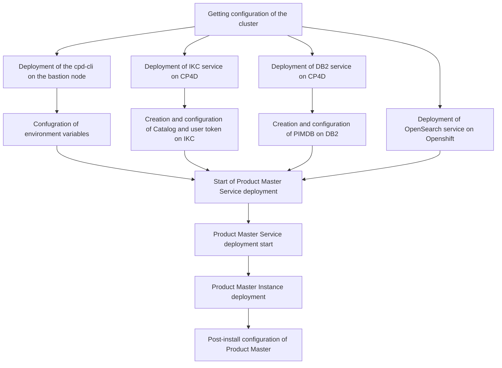

The deployment of Product Master on CP4D v5 is performed as a sequencial install of several components in a proper order. In many of the steps prior to continue with deployment of next component the specific configuration activiites on the previous one have to be performed.

# Creation and configuration of PIMDB on DB2

Providing the repository tier is must-have pre-requisite for the deployment of IBM Product Master. According to current documentation, the supported repository types are Oracle and DB2. Since in this setup we deploy the Product Master service on Cloud Pak for Data, the default should be deployment of the DB2 for these purposes, but still Oracle outside of the cluster remains the valid option. For Oracle related pre-requisites please refer to documentation of PM and Oracle.

Below on the screenshot are parameters which I've used for the base setup of the demo instance of DB2. The proper sizing excerse should be performed for production deployment jointly with IBM technical team.

Get information about CP4D project you install service into from oc web console. At my cluster it's 'cpd'.

Get information about installed DB2 instance. The cluster may have several instanced deployed. E.g. in my case the second instance stands for repository of Cognos Analytics - another service on CP4D.

The one you need is by name similar to the Deployment ID from the first screenshot.

Get the OC login command from Web-UI

Now open the terminal and use the login command to get to openshift cluster. Top-right corner, 'Copy login command', on the next screen - 'Display token'.

Currently message shows you are in the 'default' project. Switch to the proper project ('cpd' in my case).

Get to the DB2 pod of the name located previously

Get the passwod for the DB2 instance you've created earlier

Get created database name

Get the service name of the database that is to be used as IBM Db2 host database name in app-secret

defatul port number is 50000 - in my case it's line 2

Start creation of the TABLESPACES as per documentation in the pod used earlier:

# Install OpenSearch

Create persistent volumes

chanht the namespace to project name of your CP4D cluster, same as use proper name of the Storage Class which can be looked up in the web-UI of Openshift

cat <<EOF| oc apply -f -
apiVersion: v1
kind: PersistentVolumeClaim
metadata:
name: opensearch-cluster-master-opensearch-cluster-master-0
namespace: cpd
spec:
accessModes:

- ReadWriteOnce
  resources:
  requests:
  storage: 2Gi
  storageClassName: ocs-storagecluster-cephfs
  volumeMode: Filesystem
  EOF

---

Verification of instance

oc get ProductMaster productmaster-cr -o jsonpath='{.status.productmasterStatus} {"\n"}'
