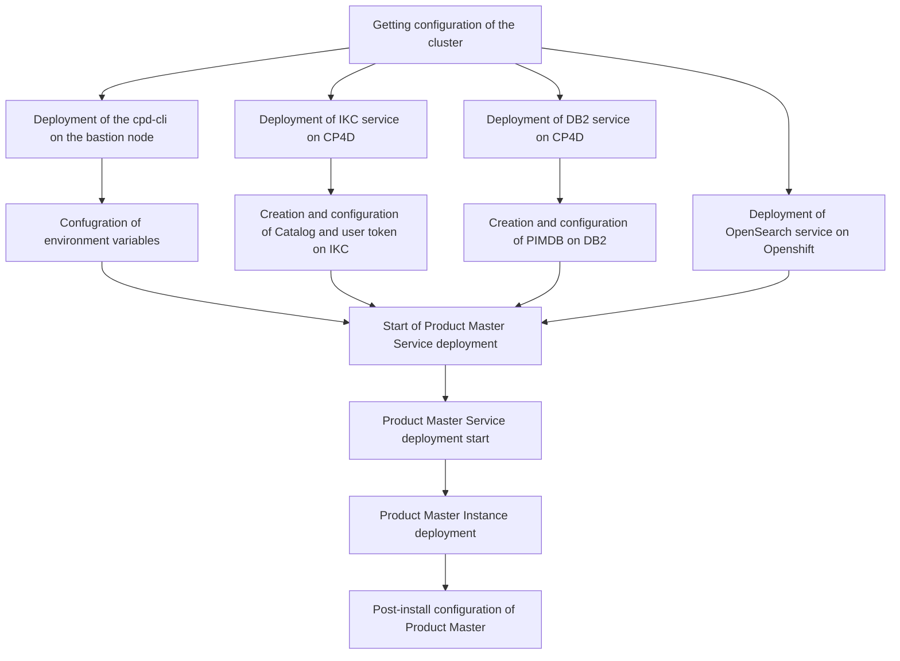

# IBM Product Master sample deployment demo

> [!CAUTION]
> This article is still in work. Instructions as of now do not cover the full deployment process.

The deployment of Product Master on CP4D v5 is performed as a sequencial install of several components in a proper order. In many of the steps prior to continue with deployment of next component the specific configuration activiites on the previous one have to be performed.

# Confugration of environment variables

# Deployment of IKC service on CP4D

IBM Product Master integrates with IBM Knowledge Catalog service for the metadata management purposes. This integration is optional.

For this specific excersise I'm using the previously deployed IKC service with all additional options set to 'true' and the 'small' tier configuration. But the minimum configuration is also supported.

# Creation and configuration of Catalog and user token on IKC

# Deployment of OpenSearch service on Openshift

# Deployment of DB2 service on CP4D

For this demo I've used the Deployer pipeline documented on the IBM github. Since the Cognos Analytics service also required repository, it has been deployed together with instance. This instance you will see later on this guide and I will show how to distinguish that one from the one we will work with.

ConfigMap part for DB2 originally used has been the following:

''' - name: db2
description: Db2 OLTP
size: small
instances: - name: ca-metastore
metadata_size_gb: 20
data_size_gb: 20
backup_size_gb: 20  
 transactionlog_size_gb: 20
state: installed
'''

If you have not deployed other services with DB2 requirement on this cluster, then simply the initial the DB2 service in 'small' tier size. Then you may create the instance in CP4D web UI.

''' - name: db2
description: Db2 OLTP
size: small
state: installed
'''

# Creation and configuration of PIMDB on DB2

Providing the repository tier is must-have pre-requisite for the deployment of IBM Product Master. According to current documentation, the supported repository types are Oracle and DB2. Since in this setup we deploy the Product Master service on Cloud Pak for Data, the default should be deployment of the DB2 for these purposes, but still Oracle outside of the cluster remains the valid option. For Oracle related pre-requisites please refer to documentation of PM and Oracle.

Below on the screenshot are parameters which I've used for the base setup of the demo instance of DB2. The proper sizing exercise should be performed for production deployment jointly with IBM technical team.

Get information about CP4D project you install service into from oc web console. At my cluster it's 'cpd'.

Get information about installed DB2 instance. The cluster may have several instanced deployed. E.g. in my case the second instance stands for repository of Cognos Analytics - another service on CP4D.

The one you need is by name similar to the Deployment ID from the first screenshot.

Get the OC login command from Web-UI.

Now open the terminal and use the login command to get to openshift cluster. Top-right corner, 'Copy login command', on the next screen - 'Display token'.

Currently message shows you are in the 'default' project. Switch to the proper project ('cpd' in my case).

Get to the DB2 pod of the name located previously.

Get the password for the DB2 instance you've created earlier. You will need that later for creation of YAML file

Switch to the 'db2inst1' user.

Get created database name.

Get the service name of the database that is to be used as IBM Db2 host database name in app-secret.

Defatul port number is 50000 - in my case it's line 2.

Start creation of the TABLESPACES as per documentation in the pod used earlier. Switch to the db2 pod and verify that PIMDB is present there.

Connect to PIMDB.

Start execution of the scripts from documentation - as is, no modification is required

Make sure that execution is successfull. If not, debug that with your DB2 administrator.

# Install OpenSearch

## Create persistent volumes.

Change the namespace to project name of your CP4D cluster, same as use proper name of the Storage Class which can be looked up in the web-UI of Openshift

'''
cat <<EOF| oc apply -f -
apiVersion: v1
kind: PersistentVolumeClaim
metadata:
name: opensearch-cluster-master-opensearch-cluster-master-0
namespace: cpd
spec:
accessModes:

- ReadWriteOnce
  resources:
  requests:
  storage: 2Gi
  storageClassName: ocs-storagecluster-cephfs
  volumeMode: Filesystem
  EOF
  '''
  

---

# Verification of Database connection

Login to Db2 pod and use the path '/opt/MDM/bin/' to initiate the script run for testing the repository connection status

This is the confirmation that all connection parameters including username and password have been provided correctly, same as the repository itself is up and running.

---

# Verification of instance

oc get pods |grep productmaster

oc get ProductMaster productmaster-cr -o jsonpath='{.status.productmasterStatus} {"\n"}'

To get the access to the platform the proper URL link should be used. This can be revealed using the 'oc get routes' command

First 2 lines in resonse in my case stand for URLs to the Persona and Admin UIs.
