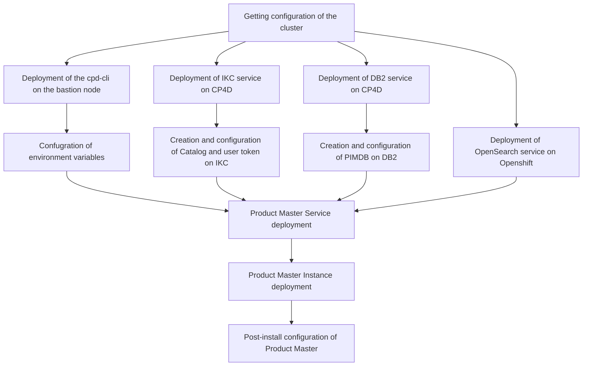

# IBM Product Master sample deployment demo

> [!CAUTION]
> This article is still in work. Instructions as of now do not cover the full deployment process.

The deployment of Product Master on CP4D v5 is performed as a sequencial install of several components in a proper order. In many of the steps prior to continue with deployment of next component the specific configuration activiites on the previous one have to be performed.



# Confugration of environment variables

The bastion node or your local laptop you plan to use for deployment of Product Master or any other services using CPD-CLI should use the proper set of Environment variables in order to use the scripts from documentation with minimum changes.

Build the following file as per my example below. For basic deployment as per this demo you don't actually need to complete all the lines, but only ones as shown.

- OCP_URL - Get this URL from the OC login command in your Openshift console. It may be on different port vs one mentioned in documentation. In my case it's `6443`.
- OCP_USERNAME - `kubeadmin` or other similar user with administrative privileges on your cluster
- OCP_PASSWORD - password of the same user
- OCP_TOKEN - get this value from the OC login command in your Openshift console. In my case that starts with `sha256~`.

- PROJECT_CPD_INST_OPERATORS - get this value from the list of the projects in Openshift console. In my case that is `cpd-operators`.
- PROJECT_CPD_INST_OPERANDS - get this value from the list of the projects in Openshift console. In my case that is `cpd`.

Get Operators name from this screen in your environment:


Operands is the name of the project you have CP4D deployed. This can be refealed by searching for Pods of other your deployed services (column Namespaces), e.g. IKC you will integrate Product Master Metadata information with later on.


- STG_CLASS_BLOCK - get this value from the list of the storage classes in Openshift console. In my case that is `ocs-storagecluster-cephfs`.
- STG_CLASS_FILE - get this value from the list of the storage classes in Openshift console. In my case that is `ocs-storagecluster-cephfs`.


- IBM_ENTITLEMENT_KEY - the Entitlement key for connection to IBM repo.

```
#===============================================================================
# Cloud Pak for Data installation variables
#===============================================================================

# ------------------------------------------------------------------------------
# Client workstation
# ------------------------------------------------------------------------------
# Set the following variables if you want to override the default behavior of the Cloud Pak for Data CLI.
#
# To export these variables, you must uncomment each command in this section.

# export CPD_CLI_MANAGE_WORKSPACE=<enter a fully qualified directory>
# export OLM_UTILS_LAUNCH_ARGS=<enter launch arguments>


# ------------------------------------------------------------------------------
# Cluster
# ------------------------------------------------------------------------------

export OCP_URL=https://api.XXXXXXX.ocp.techzone.ibm.com:6443
export OPENSHIFT_TYPE=self-managed
export IMAGE_ARCH=amd64
export OCP_USERNAME=kubeadmin
export OCP_PASSWORD=Place you value here
export OCP_TOKEN=sha256~XXXXXX-Place you value here
export SERVER_ARGUMENTS="--server=${OCP_URL}"
# export LOGIN_ARGUMENTS="--username=${OCP_USERNAME} --password=${OCP_PASSWORD}"
export LOGIN_ARGUMENTS="--token=${OCP_TOKEN}"
export CPDM_OC_LOGIN="cpd-cli manage login-to-ocp ${SERVER_ARGUMENTS} ${LOGIN_ARGUMENTS}"
export OC_LOGIN="oc login ${OCP_URL} ${LOGIN_ARGUMENTS}"


# ------------------------------------------------------------------------------
# Proxy server
# ------------------------------------------------------------------------------

# export PROXY_HOST=<enter your proxy server hostname>
# export PROXY_PORT=<enter your proxy server port number>
# export PROXY_USER=<enter your proxy server username>
# export PROXY_PASSWORD=<enter your proxy server password>


# ------------------------------------------------------------------------------
# Projects
# ------------------------------------------------------------------------------

# #export PROJECT_CERT_MANAGER=<enter your certificate manager project>
# #export PROJECT_LICENSE_SERVICE=<enter your License Service project>
# #export PROJECT_SCHEDULING_SERVICE=<enter your scheduling service project>
# export PROJECT_IBM_EVENTS=<enter your IBM Events Operator project>
# export PROJECT_PRIVILEGED_MONITORING_SERVICE=<enter your privileged monitoring service project>
export PROJECT_CPD_INST_OPERATORS=cpd-operators
export PROJECT_CPD_INST_OPERANDS=cpd
# export PROJECT_CPD_INSTANCE_TETHERED=<enter your tethered project>
# export PROJECT_CPD_INSTANCE_TETHERED_LIST=<a comma-separated list of tethered projects>


# ------------------------------------------------------------------------------
# Storage
# ------------------------------------------------------------------------------

export STG_CLASS_BLOCK=ocs-storagecluster-cephfs - Place you value here instead
export STG_CLASS_FILE=ocs-storagecluster-cephfs - Place you value here instead

# ------------------------------------------------------------------------------
# IBM Entitled Registry
# ------------------------------------------------------------------------------

export IBM_ENTITLEMENT_KEY=eyJhbGciOiJdivsboksASQUuk-Place you value here instead - that is the long string you own from IBM.


# ------------------------------------------------------------------------------
# Private container registry
# ------------------------------------------------------------------------------
# Set the following variables if you mirror images to a private container registry.
#
# To export these variables, you must uncomment each command in this section.

# export PRIVATE_REGISTRY_LOCATION=<enter the location of your private container registry>
# export PRIVATE_REGISTRY_PUSH_USER=<enter the username of a user that can push to the registry>
# export PRIVATE_REGISTRY_PUSH_PASSWORD=<enter the password of the user that can push to the registry>
# export PRIVATE_REGISTRY_PULL_USER=<enter the username of a user that can pull from the registry>
# export PRIVATE_REGISTRY_PULL_PASSWORD=<enter the password of the user that can pull from the registry>


# ------------------------------------------------------------------------------
# Cloud Pak for Data version
# ------------------------------------------------------------------------------

export VERSION=5.0.0


# ------------------------------------------------------------------------------
# Components
# ------------------------------------------------------------------------------

export COMPONENTS=ibm-cert-manager,ibm-licensing,scheduler,cpfs,cpd_platform
# export COMPONENTS_TO_SKIP=<component-ID-1>,<component-ID-2>


# ------------------------------------------------------------------------------
# watsonx Orchestrate
# ------------------------------------------------------------------------------
# export PROJECT_IBM_APP_CONNECT=<enter your IBM App Connect in containers project>
# export AC_CASE_VERSION=<version>
# export AC_CHANNEL_VERSION=<version>
```

# Deployment of IKC service on CP4D

IBM Product Master integrates with IBM Knowledge Catalog service for the metadata management purposes. This integration is optional.

For this specific excersise I'm using the previously deployed IKC service with all additional options set to `true` and the `small` tier configuration. But the minimum configuration is also supported.

# Creation and configuration of Catalog and user token on IKC

For this demo I've created the catalog with the name `Enterprise Catalog` and will use the `admin` user as the owner of this catalog for integration with Product Master


The API key can be received by openning `Profile and settings` page of the `admin` user


Then clicking the `API key` button on top-right.


# Deployment of DB2 service on CP4D

For this demo I've used the Deployer pipeline documented on the IBM github. Since the Cognos Analytics service also required repository, it has been deployed together with instance. This instance you will see later on this guide and I will show how to distinguish that one from the one we will work with.

ConfigMap part for DB2 originally used has been the following:

```
- name: db2
  description: Db2 OLTP
  size: small
  instances: - name: ca-metastore
  metadata_size_gb: 20
  data_size_gb: 20
  backup_size_gb: 20
  transactionlog_size_gb: 20
  state: installed
```

If you have not deployed other services with DB2 requirement on this cluster, then simply the initial the DB2 service in `small` tier size. Then you may create the instance in CP4D web UI.

```
- name: db2
  description: Db2 OLTP
  size: small
  state: installed
```

# Creation and configuration of PIMDB on DB2

Providing the repository tier is must-have pre-requisite for the deployment of IBM Product Master. According to current documentation, the supported repository types are Oracle and DB2. Since in this setup we deploy the Product Master service on Cloud Pak for Data, the default should be deployment of the DB2 for these purposes, but still Oracle outside of the cluster remains the valid option. For Oracle related pre-requisites please refer to documentation of PM and Oracle.

Below on the screenshot are parameters which I've used for the base setup of the demo instance of DB2. The proper sizing exercise should be performed for production deployment jointly with IBM technical team.


Get information about CP4D project you install service into from oc web console. At my cluster it's `cpd`.


Get information about installed DB2 instance. The cluster may have several instanced deployed. E.g. in my case the second instance stands for repository of Cognos Analytics - another service on CP4D.


The one you need is by name similar to the Deployment ID from the first screenshot.


Get the OC login command from Web-UI.


Now open the terminal and use the login command to get to openshift cluster. Top-right corner, `Copy login command`, on the next screen - `Display token`.


Currently message shows you are in the `default` project. Switch to the proper project (`cpd` in my case).


Get to the DB2 pod of the name located previously.


Get the password for the DB2 instance you've created earlier. You will need that later for creation of YAML file


Switch to the `db2inst1` user.


Get created database name.


Get the service name of the database that is to be used as IBM Db2 host database name in app-secret.


Defatul port number is 50000 - in my case it's line 2.

Start creation of the TABLESPACES as per documentation in the pod used earlier. Switch to the db2 pod and verify that PIMDB is present there.


Connect to PIMDB.


Start execution of the scripts from documentation - as is, no modification is required


Make sure that execution is successfull. If not, debug that with your DB2 administrator.

# Install OpenSearch

## Before you install OpenSearch

Before installing Opensearch make sure you have helm package deployed.

## Create persistent volumes.

Change the namespace to project name of your CP4D cluster, same as use proper name of the Storage Class which can be looked up in the web-UI of Openshift


Create first Pesistent Volume Claim using the code below

```
cat <<EOF| oc apply -f -
apiVersion: v1
kind: PersistentVolumeClaim
metadata:
name: opensearch-cluster-master-opensearch-cluster-master-0
namespace: cpd
spec:
accessModes:

- ReadWriteOnce
  resources:
  requests:
  storage: 2Gi
  storageClassName: ocs-storagecluster-cephfs
  volumeMode: Filesystem
  EOF
```


Repeate this tep 2 more times for creation of total 3 Pesistent Volume Claims. Only change is the number in the name attribute.


## OpenSearch configuration and deployment

Using terminal login to Openshift and check if any Opensearch repository installed


In my case there is no such repository, then it should be deployed and presence should be validated.


Update the repository


Deploy OpenSearch


Check pods status intil 3 master pods of OpenSearch would be running. This can be done using Terminal.


Or same can be checked in Openshift web based console


Check the service up and running


Follow the documentation to create server and client certificates with information about your organization. This step is straight forward described in documentation. Replace XXXX values to your own and make notes about those for further steps.

Finalize creation of the certificate


Before copy of certificate to the containers make sure you have the proper folder strucuture on each of them. If not, create required folders by connecting to each container directly.


Copy the certificate to the created folders


Edit ConfigMap of the Opensearch


In the top "data" section add the line from documentation for max_clause_count


In the Security section remove default parameters starting from http line down including line with certificate ssignature parameters.


Replace that with the data from documetnation and the parameters of your own certificate you've noted few steps above.


Restart the pods of OpenSearch either by changeing the Replicas number as per documentation first to 0 then back to 3. These steps are described in documentation.

Alternative to terminal is to simply delete those 3 pods from web-console. Openshift will automatically restore those as per configuration and number of replicas, but the pod creation will happen with already new parameters you've changed


Wait until all the pods will be brought back up.


OpenSearch setup has been complete.

---

# Secret creation

Prepare the Secret for IBM Product Master deployment. Using the "+" in the top-right of Openshift console create an import of the YAML file with details of pre-requisites you've installed on the cluster. You will need the parameters for DB2 connection, IKC Catalog details and Opensearch configruation. Last one is taken from documentation page in the knowledge center. Last the OpenSearch Certificate should be joined as a single line, no quotes or separator (as per screenshot).


---

# Deployment of Product Master

## Docker deployment

Docker is a must-have pre-req for the CP4D deployment, so it should be installed on the workstation you will be deploying Product Master from.

If not installed, switch to root and perfom deployment. Here is the sample for RHEL OS.


## CPD_CLI deployment

Before you begin, make sure you have setup the CPD-CLI.

Solution guide can be found here `https://www.ibm.com/docs/en/cloud-paks/cp-data/5.0.x?topic=cli-installing-cpd`

The distributive can be downloaded from this link `https://github.com/IBM/cpd-cli/releases`

Switch back to admin user, create cpd-cli directory in your home folder.

Then download cpd-cli distributive using wget command from the URL you will find in documentation for your OS by the links above


Unpack the distributive from Tar


Make sure you have at the same location the file of Environment variables, which has been created on the early steps.

Source those variables.


Add cpd-cli to the PATH.


Next step is to log in to the cluster. If you have Environment variable set correctly, then the default command from the documentation script should work


Initiate the deployment of Product Master Service


The run of apply-olm should finish successfully


Start creation of Custom Resource for the Product Master


Action should be finished successfully


Verify the status


All good so far!

Product Master service has been deployed, but it requires instance for operation. Documentation explains the steps in the Post-install section

## Product Master instance creation

The instance creation has the dependency currently not well described in the documentation. That is the finalization of DB2 related activities intil completion of the Instance creation.

The run of instance creation is a simple command from documentation. Again, if you have proper environment variables file applied, this should be a copy-paste from documentation.


The issue you may face is that at some point of time the process would be stuck for waiting for resolving some internal dependencies


If not acting before that, then you will get the error in couple of hours and the instance deployment will be failed


The possible reason for that is that not all the actions on DB2 repository has been properly complete.

When checking the pods of Product Master you can see that the Scheduler and Workflow pods are not ready and failing.


Use the steps from documentation Post-install DB2 section to fix the issue.

Connect to the Product Master admin pod. Source the bash_profile. Then switch to the /opt/MDM/bin folder


Run the ./test_db.sh script


In my case it showed that connection is failed. Exit the pod.


Get to the pod of DB2 repository with PIMDB repository


Check that Database is up and running


Quit from db2 and exit the pod


Login back to Product Master admin pod


Source the bash_profile same way as last time and then switch to the foler /opt/MDM/bin/db

Locate the create_schema.sh script and run it. Confirm that you want the execution to proceed as per screenshot


Wait for the script to finish. There may be the error related to some rollback, but overal execution will pass OK.

Switch to /opt/MDM/bin folder (1 level up)

Run test_db.sh command again

now it should be finished successfully


Now exit the Product master admin pod and check the status of the all Product Master pods


As you can see, even without the need to restart the instance creation, all the pods, including the ones of scheduler and workflow, are Running 1/1

Job done!

---

# Verification of instance

Check if Product Master pods are all Running at 1/1 configuration.

```
oc get pods |grep productmaster
```


```
oc get ProductMaster productmaster-cr -o jsonpath='{.status.productmasterStatus} {"\n"}'
```


To get the access to the platform the proper URL link should be used. This can be revealed using the `oc get routes` command


First 2 lines in resonse in my case stand for URLs to the Persona and Admin UIs.
