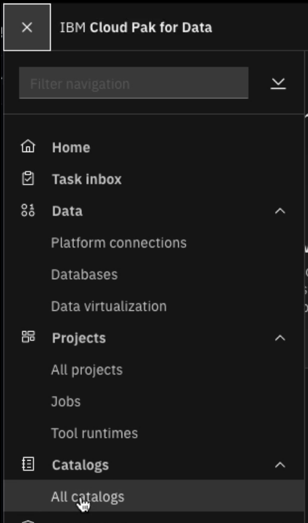
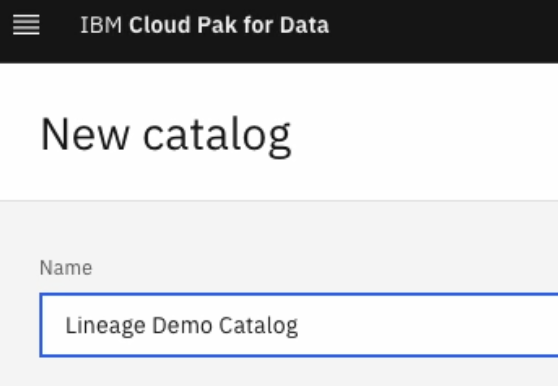
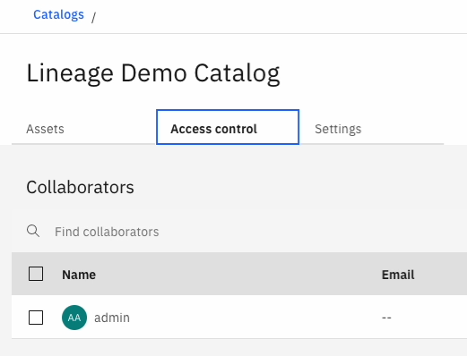

# 1. Objectives

The goal of this excersise is to demonstrate the capabilities of IBM Cloud Pak for Data on monitoring the data lineage, discovery of the internal pipelines in databases and external to then pipelines of DataStage ETL jobs running on IBM CP4D by using the IBM Manta software service.

The lab will use 2 databases and 2 ETL jobs to demonstrate the value of data lineage with Manta.

# 2. Pre-work

## 2.1 Data sources

Before starting the lab excersise please prepare 2 RDBMS data sources. Here we are to use the Postgres available databases deployed outside of CP4D cluster but which CP4D is able to natively connect to.

I've used the DVD Rental Database described in section [Sample data assets](/Setup%20WKC%20demo%20environment/Data%20Assets/Sample_data_assets.md). The database has been deployed twice on different schemas to serve as the source and as a target for the pipelines lineage.

## 2.2 Services used in the lab

For successful lab execution CP4D instance should have IKC, Manta and DataStage Ent. services deployed

## 2.3 Environment setup

### User creation

We would separate this demo scenario from the other topics and also demonstrate how the Connectors can be freely shared by the authorised user with other Data Stewards

For that we would need the different user to be created in CP4D main menu - Administration - Access Control

Click "Add users" in the right-top corner

I will create John Lineage here

For Platform assess select "Assign roles directly" and click Next

Provide the user Role of Data Steward

