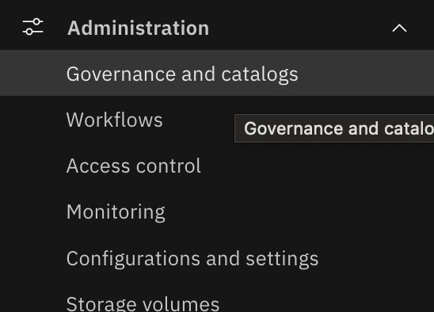

# Why we need custom assets

I've recently received one of the questions from existing Information Server - Infosphere Governance Catalog client if they can switch to CP4D IKC with few important features of their current install to be still availabla after migration. The original question was if the following relathionship visualization they have in IGC could be migrated to IKC

That relationship diagram allows to demonstrate the connections between different types of governance artifacts with results of metadata import and, what's important, also with custom assets you could previously configure via 'bundles' in IGC.

# Pre-requisites

To run this demo you would need:

1. CP4D v4.8.3 or later
2. IKC service with administative privileges
3. if before CP4D v5 the Beta Relationship explorer feature on the IKC governance UI and Catalog portal should be enabled

# Custom asset creation sample

