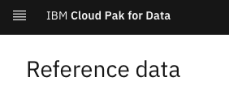
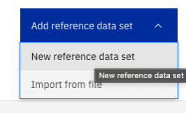
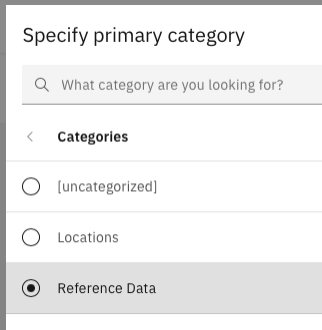
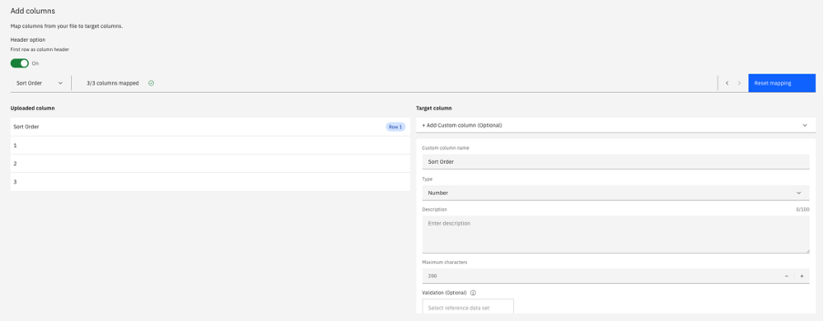
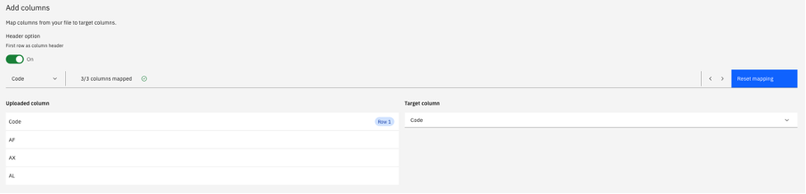
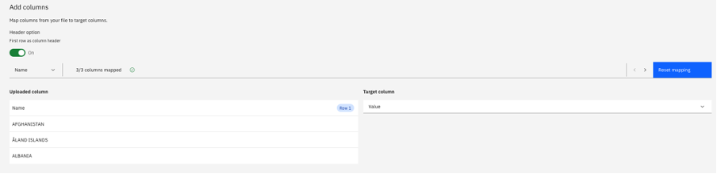
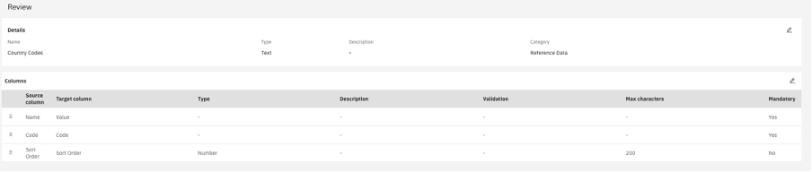
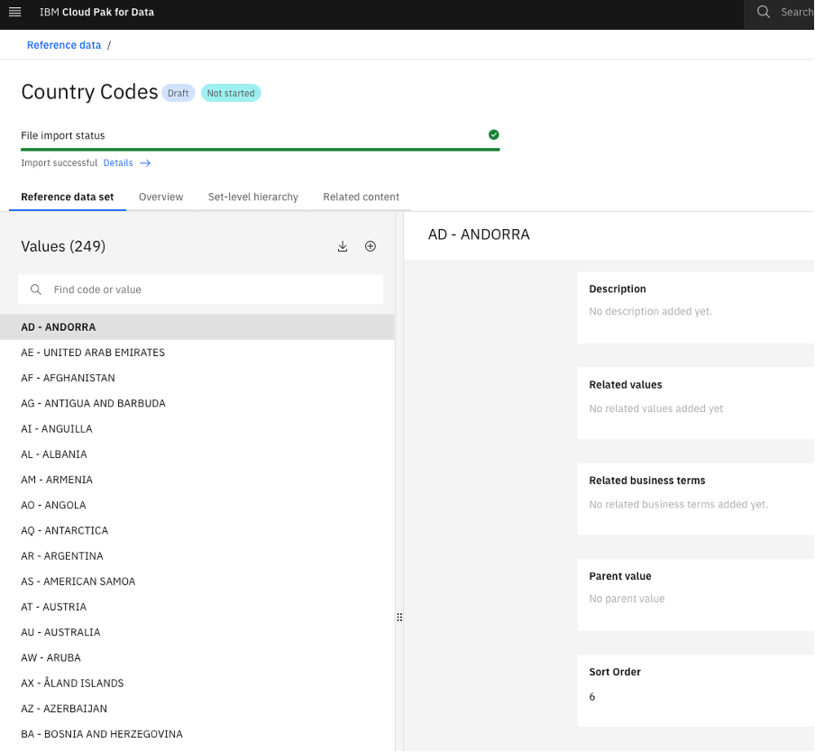
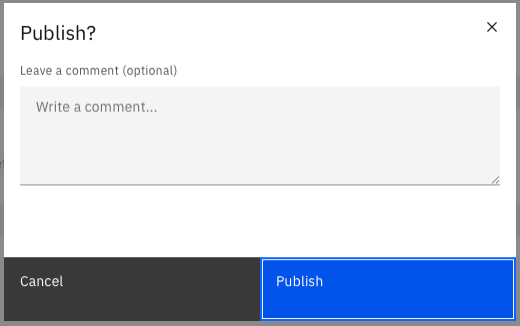
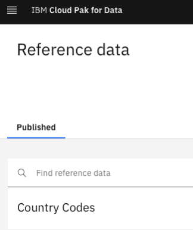

# Creation of the new Reference data sets

## Before you start

- Make sure you have the "Reference Data" category in the Glossary
- Prepare the csv file with reference data of proper format on your own laptop

## Steps to create new Reference data set

Select Add new reference data set - New reference data set

upload the file, provide the Reference data set name and specify the parent category

Click NEXT

Map the columns

Click Next and review the mapping summary

When all columns are mapped, click Create

Reference data set has been created in a draft stage

You need to publish it for making it available for larger audience

Now you will see the Reference data set available for CP4D users with corresponding permissions

